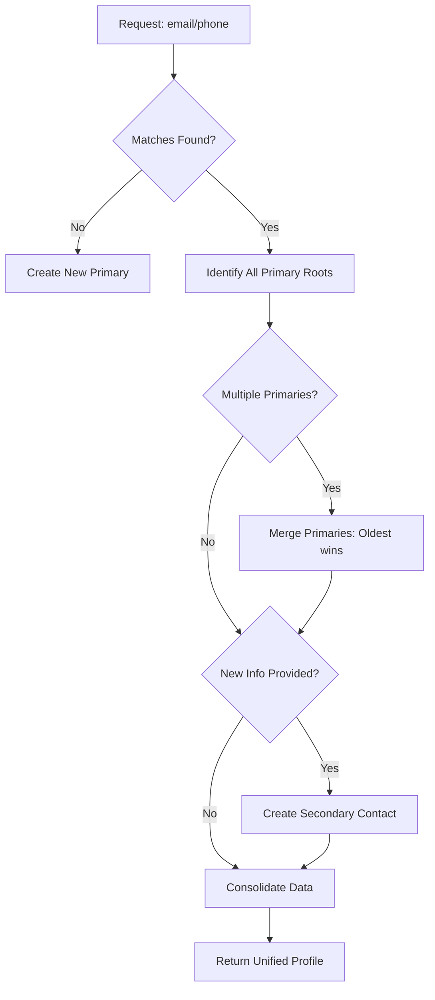

# Identity Reconciliation Service

[](https://nodejs.org/)
[](https://reactjs.org/)
[](https://www.prisma.io/)
[](https://www.typescriptlang.org/)

A sophisticated Full-Stack Customer Identity Resolution service designed to link disparate customer data points (emails and phone numbers) into a unified primary contact profile. This project solves the "Identity Reconciliation" problem by intelligently merging records as new information is captured across different touchpoints.

### 🌐 Live Deployments
* **Frontend Dashboard**: [https://identity-fusion-unts.vercel.app](https://identity-fusion-unts.vercel.app/)
* **Hosted Backend API**: [https://identityfusion.onrender.com](https://identityfusion.onrender.com/identify)

---

## 🚀 The Core Logic: How it Works

The heart of this application is the `/identify` endpoint. It processes incoming contact information and determines if it belongs to an existing user or represents a new identity.

1.  **Search**: Queries the database for any contact matching the provided `email` or `phoneNumber`.
2.  **Primary Identification**: Identifies the oldest "primary" contact associated with any matching records.
3.  **Automatic Merging**: If two previously independent identities are found to be linked by a new piece of information, the service merges them, demoting the younger primary to "secondary" status.
4.  **Information Enrichment**: If the request contains new information (e.g., a new email for an existing phone number), it creates a "secondary" contact linked to the primary.
5.  **Consolidated View**: Returns a complete picture of the user's identity, including all linked emails, phone numbers, and secondary IDs.

### 📊 System Flow



---

## 🛠️ Technology Stack

### **Backend** (Server-Side)
- **Node.js & Express**: High-performance runtime and framework for the API.
- **TypeScript**: Ensuring type safety and robust code architecture.
- **Prisma ORM**: Modern database access layer for seamless SQLite interactions.
- **SQLite**: Lightweight, relational database for reliable identity storage.

### **Frontend** (Dashboard)
- **React 18**: Modern UI library for a responsive and dynamic user experience.
- **Vite**: Ultra-fast build tool for rapid development.
- **Glassmorphism UI**: A futuristic, high-end design aesthetic using custom CSS.
- **Lucide React**: For sleek, modern iconography.

---

## 📦 Getting Started

### Prerequisites
- Node.js (v18 or higher)
- npm or yarn

### 1. Project Initialization

First, clone the repository and install dependencies for both the backend (root) and frontend.

```bash
# In the root directory
npm install

# In the frontend directory
cd frontend
npm install
```

### 2. Database Setup

Using Prisma, we initialize the SQLite database and generate the client.

```bash
# Back in the root directory
npx prisma generate
npx prisma migrate dev --name init
```

### 3. Running the Application

For the best experience, run both the server and the frontend client simultaneously.

#### **Start the Backend Server**
```bash
# From the root directory
npm run dev
# Server will start on http://localhost:3000
```

#### **Start the Frontend Dashboard**
```bash
# From the frontend directory
npm run dev
# Client will start on http://localhost:5173
```

---

## 🔗 API Documentation

### **POST** `/identify`

**Request Body:**
```json
{
  "email": "mabe@example.com",
  "phoneNumber": "123456"
}
```

**Response Body (200 OK):**
```json
{
  "contact": {
    "primaryContatctId": 1,
    "emails": ["mabe@example.com", "lorraine@example.com"],
    "phoneNumbers": ["123456", "789012"],
    "secondaryContactIds": [23]
  }
}
```

---

## ✨ Features

- ✅ **Smart Merging**: Automatically bridges two contact trees when a common link is discovered.
- ✅ **Deterministic Results**: Always prioritizes the oldest record as the primary source of truth.
- ✅ **Futuristic UI**: A high-end dashboard to test identity resolution in real-time.
- ✅ **Type-Safe**: End-to-end TypeScript implementation for both backend and frontend.
- ✅ **Fast & Lightweight**: Zero-config SQLite database and Vite-powered frontend.

---

## 👨‍💻 Author

Created with ❤️ by **Reethikaa05**
*Seeking to solve complex data challenges with elegant code.*
